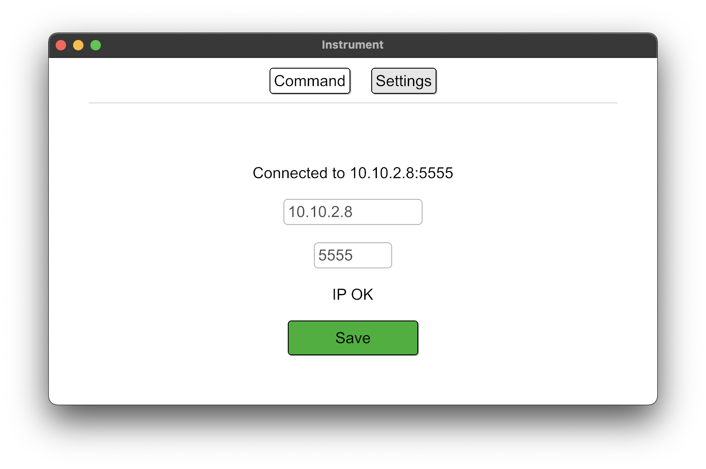
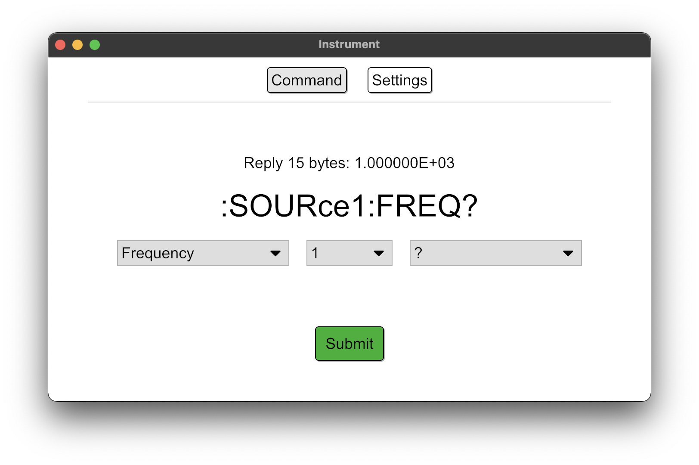

# instrument-app

## Summary
Extensible cross-platform GUI application for controlling lab instruments over the network using SCPI commands.

## Goals
* Easily extensible for new devices and new commands
* Cross-platform availability (Linux*, Windows, macOS)
* Easy to use

*Installation on Linux may require some extra steps, please refer to the [iced](https://github.com/hecrj/iced) documentation.

## Screenshots

## How to use
1. Download the repository
2. Adapt the settings in `config/config.toml` to your needs
3. Run `$ cargo run -- <PATH TO CONFIG>` to start the application
4. Connect to your device by entering its IP-address and the port (often `5555`)
5. Select a command and enter the according parameters - and send it to the device!

## Documentation
Available via `$ cargo doc --no-deps --open`.

## License
MIT, see [LICENSE](LICENSE)
